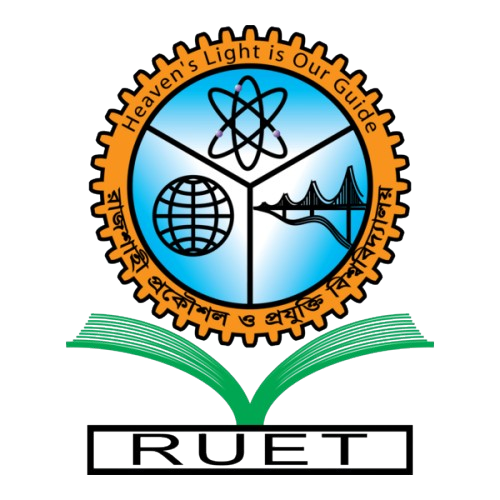

# ESP32 DC Motor Controller with Flask Web Interface

A web-based DC motor controller using ESP32, L298N motor driver, and Flask web application with real-time speed control via WiFi.



## 🚀 Features

- **Real-time Speed Control**: Adjust motor speed dynamically using a slider (0-255 PWM)
- **Direction Control**: Forward, Reverse, and Stop commands
- **WiFi Connectivity**: Control motor wirelessly through web interface
- **Responsive Design**: Beautiful animated UI with custom background and RUET logo
- **Live Feedback**: Real-time status updates and visual indicators
- **Auto Speed Update**: Slider automatically updates speed without clicking direction buttons

## 📋 Table of Contents

- [Hardware Requirements](#hardware-requirements)
- [Software Requirements](#software-requirements)
- [Circuit Diagram](#circuit-diagram)
- [Installation](#installation)
- [Usage](#usage)
- [Project Structure](#project-structure)
- [Configuration](#configuration)
- [Troubleshooting](#troubleshooting)
- [Contributors](#contributors)
- [License](#license)

## 🔧 Hardware Requirements

- **ESP32 Development Board** (ESP32 Dev Module)
- **L298N Motor Driver Module**
- **DC Motor** (6V-12V recommended)
- **Power Supply** (7-12V for motor, separate 5V for ESP32 if needed)
- **Jumper Wires**
- **Breadboard** (optional)

## 💻 Software Requirements

- **Arduino IDE** (v1.8.x or higher)
- **ESP32 Board Package** (v3.x or v2.x)
- **Python** (v3.7 or higher)
- **Flask** (v2.x or higher)
- **Requests library** for Python

## 🔌 Circuit Diagram

### ESP32 to L298N Connections:

| ESP32 Pin | L298N Pin | Description |
|-----------|-----------|-------------|
| GPIO 25   | IN1       | Motor Direction Control 1 |
| GPIO 26   | IN2       | Motor Direction Control 2 |
| GPIO 27   | ENA       | PWM Speed Control (Enable A) |
| GND       | GND       | Common Ground |

### L298N to Motor Connections:

| L298N Pin | Connection |
|-----------|------------|
| OUT1      | Motor Terminal 1 |
| OUT2      | Motor Terminal 2 |
| 12V       | Power Supply (+) |
| GND       | Power Supply (-) and ESP32 GND |

> **Note**: Make sure to connect a common ground between ESP32, L298N, and power supply.

## 📦 Installation

### 1. Clone the Repository

```bash
git clone https://github.com/yourusername/esp32-motor-controller.git
cd esp32-motor-controller
```

### 2. Install Python Dependencies

```bash
pip install flask requests
```

### 3. Install Arduino ESP32 Board

1. Open Arduino IDE
2. Go to **File → Preferences**
3. Add this URL to "Additional Board Manager URLs":
   ```
   https://raw.githubusercontent.com/espressif/arduino-esp32/gh-pages/package_esp32_index.json
   ```
4. Go to **Tools → Board → Boards Manager**
5. Search for "esp32" and install **"ESP32 by Espressif Systems"**

### 4. Upload ESP32 Code

1. Open `esp32_motor_controller.ino` in Arduino IDE
2. Update WiFi credentials in the code:
   ```cpp
   const char* ssid = "YOUR_WIFI_SSID";
   const char* password = "YOUR_WIFI_PASSWORD";
   ```
3. Select **Tools → Board → ESP32 Dev Module**
4. Select the correct **Port**
5. Click **Upload**
6. Open **Serial Monitor** (115200 baud) to see ESP32's IP address

### 5. Configure Flask App

1. Open `app.py`
2. Update ESP32 IP address:
   ```python
   ESP32_IP = "http://YOUR_ESP32_IP"  # e.g., "http://192.168.1.100"
   ```

### 6. Add Static Files

Place your files in the `static/` folder:
- `logo.png` - RUET logo
- `background.gif` - Animated background

## 🎮 Usage

### 1. Start the Flask Server

```bash
python app.py
```

The server will start at `http://0.0.0.0:5000`

### 2. Access the Web Interface

- **From same computer**: Open browser and go to `http://localhost:5000`
- **From phone/other device**: Go to `http://YOUR_COMPUTER_IP:5000`

### 3. Control the Motor

1. **Forward Button**: Motor rotates forward at current speed
2. **Reverse Button**: Motor rotates in reverse at current speed
3. **Stop Button**: Motor stops completely
4. **Speed Slider**: Adjust speed from 0-255 (auto-updates while motor is running)

## 📁 Project Structure

```
esp32-motor-controller/
│
├── app.py                          # Flask backend server
├── esp32_motor_controller.ino      # ESP32 Arduino code
│
├── templates/
│   └── index.html                  # Web interface
│
├── static/
│   ├── logo.png                    # RUET logo
│   └── background.gif              # Animated background
│
├── README.md                       # Project documentation
└── requirements.txt                # Python dependencies
```

## ⚙️ Configuration

### Change WiFi Network

Edit `esp32_motor_controller.ino`:
```cpp
const char* ssid = "YOUR_WIFI_SSID";
const char* password = "YOUR_WIFI_PASSWORD";
```

### Change ESP32 IP (in Flask)

Edit `app.py`:
```python
ESP32_IP = "http://YOUR_ESP32_IP"
```

### Change GPIO Pins

Edit `esp32_motor_controller.ino`:
```cpp
const int in1 = 25;  // Change to your pin
const int in2 = 26;  // Change to your pin
const int ena = 27;  // Change to your pin
```

### Adjust PWM Frequency

Edit `esp32_motor_controller.ino`:
```cpp
const int pwmFreq = 1000;  // 1 kHz (change as needed)
```

## 🐛 Troubleshooting

### ESP32 won't connect to WiFi
- Verify SSID and password are correct
- Check if WiFi is 2.4GHz (ESP32 doesn't support 5GHz)
- Ensure WiFi network allows device connections

### Motor doesn't respond
- Check all wiring connections
- Verify power supply is sufficient (7-12V for L298N)
- Ensure common ground between ESP32 and L298N
- Check Serial Monitor for command reception

### Web interface shows "Connection Error"
- Verify ESP32 IP address in `app.py`
- Ensure ESP32 and computer are on same network
- Check if ESP32 web server is running (check Serial Monitor)

### Compilation errors
- Update ESP32 board package to latest version
- If using older version, replace `ledcAttach()` with:
  ```cpp
  ledcSetup(pwmChannel, pwmFreq, pwmResolution);
  ledcAttachPin(ena, pwmChannel);
  ```

### Slow response time
- Use the async Flask code provided (with threading)
- Optimize ESP32 code to send response before processing

## 👥 Contributors

**Group Members:**
- Nazmul Hasan Niloy - 2208031
- Tahsin Zaman Ratul - 2208032
- Nadim Abrar Prodhan - 2208033
- Ashiqur Rahman - 2208034
- M. Abdullah - 2208035
- Preta Kumar Binda - 2208036

**Institution:** Rajshahi University of Engineering & Technology (RUET)

## 📄 License

This project is licensed under the MIT License - see the [LICENSE](LICENSE) file for details.

## 🙏 Acknowledgments

- ESP32 Arduino Core by Espressif Systems
- Flask web framework
- L298N motor driver community resources

## 📧 Contact

For questions or suggestions, please open an issue on GitHub or contact the contributors.

---

**⭐ If you found this project helpful, please give it a star on GitHub!**